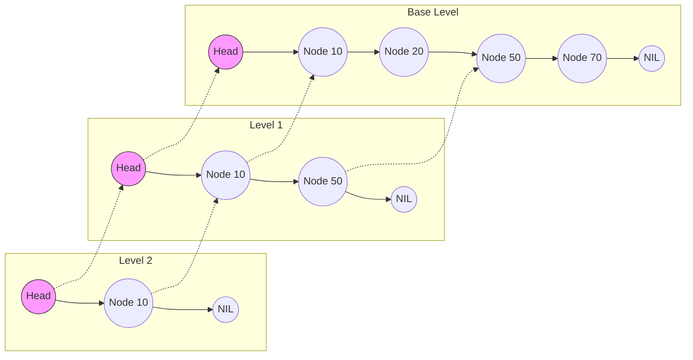

# День 1: In-Memory HLR

Мы создаем прототип **HLR (Home Location Register)** — базы данных, хранящей информацию о текущем местоположении абонентов.
В мобильных сетях HLR испытывает огромную нагрузку на чтение (где абонент?) и обновление (абонент сменил соту).
Мы будем использовать структуру данных **SkipList**, потому что она позволяет держать данные упорядоченными (важно для Range Scan — "найти всех абонентов в диапазоне префиксов IMSI") и относительно проста в реализации.

## Структура данных (SkipList)



## Какие навыки мы будем развивать
- **Алгоритмическая интуиция**: понимание вероятностных структур (почему "монетка" заменяет сложную балансировку дерева).
- **Проектирование API**: работа с итераторами (`Scan`), которые лежат в основе всех баз данных.
- **Инженерный анализ**: поиск компромисса между памятью (лишние указатели) и скоростью поиска.

## Задание

### 1) Реализовать ядро HLR (SkipList)
В файле `internal/skiplist` вам нужно реализовать:
- `Put(key, value)`: обновление профиля абонента (IMSI -> Data).
- `Get(key)`: поиск профиля.
- `Delete(key)`: удаление абонента.
- `Scan(start, end)`: поиск группы абонентов (например, диапазон IMSI).

#### Обязательные условия
- Ключи (IMSI) всегда отсортированы.
- Итератор должен быть **ленивым** (не копировать все данные в массив).
- Повторная запись того же IMSI обновляет данные.

### 2) Дополнительно
В коде вы должны выбрать параметр `p` (вероятность, с которой элемент попадает на уровень выше). Обычно `p = 0.5` или `0.25`.

**Для начала работы с утилитой тестирования:**
1. Запустите бенчмарк (или `kvtool`) на вставку 100 000 элементов с `p = 0.5`.
2. Измените `p` на `0.1` (башня растет редко, список длинный).
3. Измените `p` на `0.9` (башня растет почти всегда, много дубликатов).
4. В **заметке** напишите 2-3 предложения: как изменилась скорость и потребление памяти? Где "золотая середина"?

### 3) Интеграция
Подключите ваш SkipList к `kvtool`. Теперь утилита должна работать не на `map`, а на вашей структуре.

```bash
go run ./cmd/kvtool wordcount -in ./testdata/text_small.txt -store skiplist
```

## Самопроверка
- [ ] `Put` обновляет значение, если ключ уже есть.
- [ ] `Scan` корректно обрабатывает `nil` (начало/конец списка).
- [ ] Тесты с фиксированным `seed` проходят всегда.

## Критерии приёмки
- `make test-day1` проходит.
- Вы можете объяснить, зачем нужен `seed` в генераторе случайных чисел (воспроизводимость аварий).

## Оценка выполнения
### Уровень A — минимум
Вам нужно:
- реализовать обязательный функционал дня так, чтобы проходили тесты `make test-day1`;
- кратко описать принятые решения в заметке (шаблон: `docs/note_template.md`).

### Уровень B — стандарт (хорошо)
Дополнительно нужно:
- добавить 1–2 бенчмарка на критичные операции дня и зафиксировать тренд при росте N;
- добавить тесты на крайние случаи (пустые ключи/значения, диапазоны, повторы ключей, удаления).

### Уровень C — продвинутый (отлично)
Дополнительно нужно:
- найти и объяснить одно узкое место (память/аллокации/лишний I/O) и показать улучшение измерением;

## Антипаттерны (снижают оценку)
- Скрытое глобальное состояние, влияющее на тесты.
- Паники в библиотечном коде вместо ошибок.
- “Магия” без объяснения: использование констант или алгоритмов без понимания, почему они такие.
- Непредсказуемый порядок выдачи результатов там, где требуется упорядоченность.

# Точки самостоятельного выбора (допустимые варианты решений)

Здесь перечислены места, где вы можете выбрать свой вариант реализации.
Условие одно: внешние ко и инварианты должны сохраняться, а эффект должен быть проверяемым (тестами или бенчмарками).

## День 1: SkipList
- maxLevel:
  - фиксированная константа;
  - зависимость от ожидаемого размера;
  - параметр конструктора.
- генерация уровня:
  - coin-flip (геометрическое распределение);
  - таблица вероятностей (заранее посчитанная).
- хранение ключей/значений:
  - копирование на `Put` (безопаснее, идиоматично для Go);
  - хранение ссылок (быстрее, Zero-Copy, но требует осторожности).